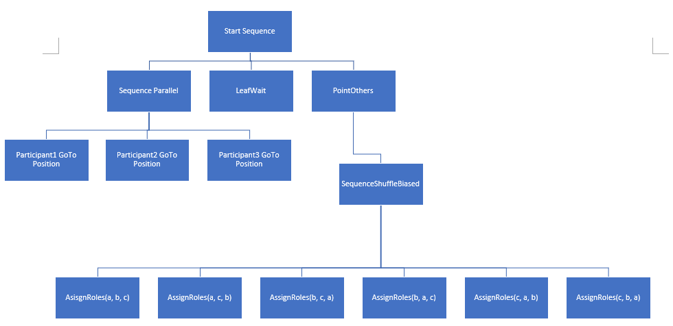
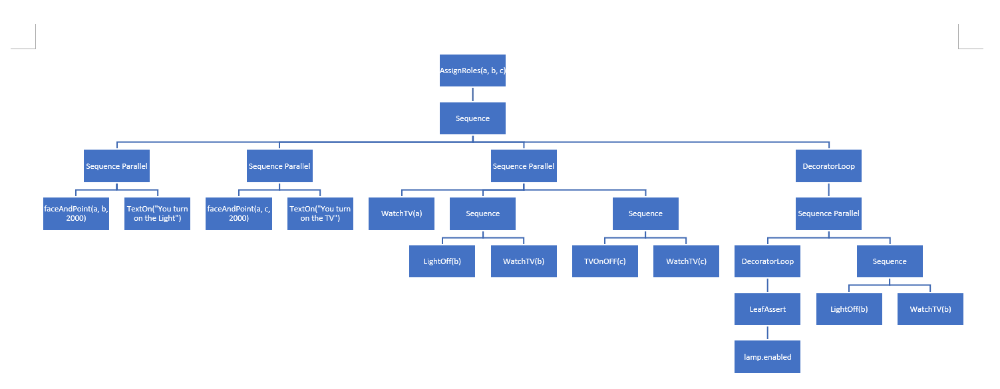

## Behavior

Three characters approach each other.  A character will point at each of the other two in turn, assign one of them to turn off the light and the other to turn on the TV.  A speech bubble at the top of the screen will have the assigner character’s words.  The character that is being assigning and what the other two are assigned to will be chosen at random.  Each character will perform their duty, and then proceed to go watch TV.  The user can press spacebar to turn the light back on, which will then cause the character assigned to the light to go turn it back off. 
(The scene uses a freelook camera with controls WASD, Q, E, R, F, and mouse) 

### Affordances
  - [x] TextOn – creates a speech bubble and fills it with text, appearing for the time specified

  - [x] LightOff – goes to a point in front of the light switch, hits the switch to activate the collider and turn off the light, then return

  - [x] faceAndPoint – orients body toward a specific position, points, then stops pointing after specified time

  - [ ] (IK) Sit down 

  - [ ] An attempt was made to use IK to shake hands between two characters, using the script ShakeIK.  However, I was unable to figure out how to activate OnAnimatorIK() and so it did not function and was not included in the behavior tree.

### Control Node Creates
SelectorShuffleBiased – this will attempt to execute a random child node until one succeeds. Different then SelectorShuffle, this will have a 40% chance of not shuffling the child nodes.  This can be used to bias the SelectorShuffle toward the first option.  In this behavior tree, it is used to bias the selection of the first participant as the assigner.

Sequence Parallel is used to allow all three participants to walk to their meeting point at the same time.
SequenceShuffleBiased is used to pick one of the following sets of assigner, light switcher, and TV switcher, with a bias toward picking the first option

Sequence is used to give an order to the following actions

Sequence Parallel allows the assigner to point at another character and the text bubbles to appear at the same time

Sequence Parallel lets each character do their duty at the same time

Decorator Loop continuously checks the Sequence Parallel to see if it is true

Leaf Assert checks the truth value of lamp.enabled