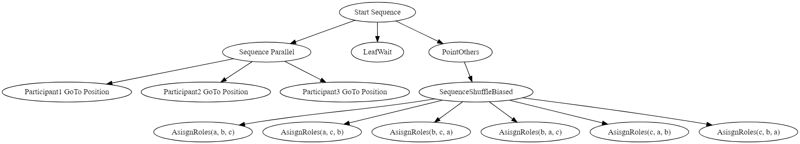
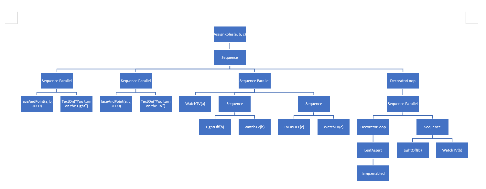

## Behavior

Three characters approach each other.  A character will point at each of the other two in turn, assign one of them to turn off the light and the other to turn on the TV.  A speech bubble at the top of the screen will have the assigner character’s words.  The character that is being assigning and what the other two are assigned to will be chosen at random.  Each character will perform their duty, and then proceed to go to sit down on the sofa and watch TV.  

### Human player controls and story continued.... (Currently a boring one)

- [x] Click to move

- [ ] Story? After the A (leader), B (turn on TV), C (turn off light) character finished their task, Player can go to talk with these 3 guys

- [ ] Show "Nothing strange happens. NPCs are watching TV......"

- [ ] Story continue? Need special event

### Event trigger
- [ ] Player hit space s.t. C try to turn off light again. C is standing nereby the light switch.

* Talk to C: "What are you doing here?"
* C: "IDK what happens. The light is broken, can you help me ask somebody to fix that?"

### Ending 1

- [ ] Ending 1

* Talk to A: "The light bulb is broken, can you help that guy fix it?"
* A: "Hah? How dare you ask me to do that? "
* A throw a bomb to you. 

- [ ] Ending 2
* Talk to B: "The light bulb is broken, can you help that guy fix it?"
* B: "Alright. I'll take a look at that."
* B go to the light switch and try to turn on, and then turn off  the light.
* Disable the space light controller. B and C go back to sofa and watch TV

**Alternative ending**: The user can press spacebar to turn the light back on, which will then cause the character assigned to the light to go turn it back off. 

**Camera**: The scene uses a freelook camera with controls WASD, Q, E, R, F, and mouse

### Affordances
  - [x] TextOn – creates a speech bubble and fills it with text, appearing for the time specified

  - [x] faceAndPoint – orients body toward a specific position, points, then stops pointing after specified time

  - [x] (IK) WatchTV - sit down on the sofa toward the TV

  - [x] (IK) Light switches and TV switches – goes to a point in front of the light switch, hits the switch to activate the collider and turn off the light, then return

### Control Node Creates
SelectorShuffleBiased – this will attempt to execute a random child node until one succeeds. Different then SelectorShuffle, this will have a 40% chance of not shuffling the child nodes.  This can be used to bias the SelectorShuffle toward the first option.  In this behavior tree, it is used to bias the selection of the first participant as the assigner.

Sequence Parallel is used to allow all three participants to walk to their meeting point at the same time.
SequenceShuffleBiased is used to pick one of the following sets of assigner, light switcher, and TV switcher, with a bias toward picking the first option

Sequence is used to give an order to the following actions

Sequence Parallel allows the assigner to point at another character and the text bubbles to appear at the same time

Sequence Parallel lets each character do their duty at the same time

Decorator Loop continuously checks the Sequence Parallel to see if it is true

Leaf Assert checks the truth value of lamp.enabled